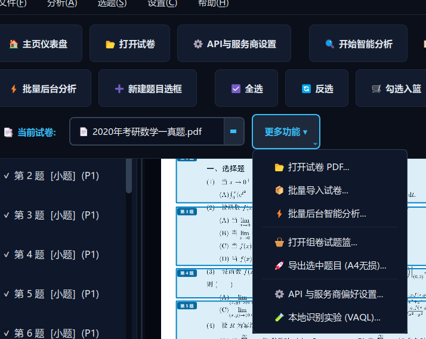
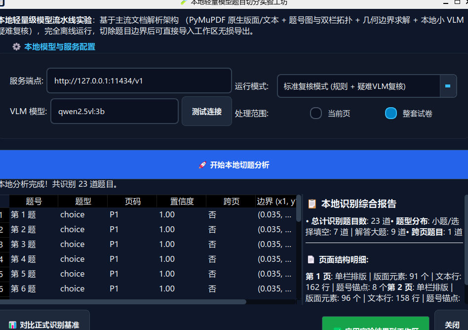

# ExamSplit AI —— 试卷 PDF 智能拆题与精细化选题导出系统

<p align="center">
  
</p>

<p align="center">
  
  
  
  
  
  
</p>

---

## 🌟 项目简介

**ExamSplit AI** 是一款面向教师、备考学生（如考研、高考、竞赛等）与教辅教研人员的现代化桌面级智能排版试卷拆分系统。

传统拆题工具往往依赖 OCR 强行将试卷转录为纯文本，但数学公式、几何矢量图表、特殊符号重排后格式千疮百孔。**ExamSplit AI 坚守“原卷唯一保真”设计哲学**：
- 🤖 **云端多模态 AI（Vision LLM）** 仅用于分析宏观试卷版面结构、判断题型并定位试题外轮廓；
- 🐍 **本地 Python 引擎（PyMuPDF）** 以微米级物理坐标直接对原生 PDF 执行矢量/栅格混合无损裁剪；
- 📄 **A4 精细化导出**：提供“单题一页刷题模式”与“流式紧凑打印模式”，内置标准 CJK 中文字体，页眉题号与页脚页码清晰工整，告别文字重录失真与导出乱码。

> [!TIP]
> **⭐ 如果这个项目对您的备考刷题或教研工作有所帮助，欢迎在 GitHub 点亮右上角的 Star 给予支持！**
> 
> **🐞 遇到任何 Bug 或切分异常？** 非常欢迎随时在 **[Issues](../../issues)** 中反馈交流，每一条建议都会认真排查与解决！

---

## 📌 版本更新日志 (Changelog)

### 🚀 v2.0 (重大版本发布)
- 🧪 **全新本地离线轻量小模型题目切分体系（Local Small-Model & Offline Pipeline）**：
  - **完全脱离云端大模型，实现 0 接口费用与 100% 数据隐私离线运行**；
  - **成熟工业级文档解析流水线**：
    1. **原生版面拓扑提取**：基于 `PyMuPDF` 页面流进行底层字符级/块级墨迹提取，通过跨中央槽文本几何比例与题号拓扑排布，高可靠判断单栏/双栏版面；
    2. **物理题号多模态锚定**：内置 `LocalMarkerDetector`，对阿拉伯数字、大写汉字（“一、选择题”）、带圈数字及选择题序号实施正则/启发式拓扑过滤，100% 消除选项分母与公式误报；
    3. **自适应几何候选框构建**：`LocalCandidateBuilder` 依据视觉阅读流确定行切分边界，结合双栏/单栏拓扑约束全幅贴紧题目墨迹；
    4. **智能置信度分流（Confidence Router）与本地小 VLM 复核**：引入快速置信度评估机制，90% 以上标准试题由本地规则引擎毫秒级秒切；针对低置信度、跨页交界等疑难场景，自动分流至本地轻量视觉小模型（支持 Ollama / llama-server 部署的 `qwen2.5vl:3b`、`llama3.2-vision:11b` 等）进行微秒级二次判定；
  - **实测性能**：在 2019、2020、2021 等复杂真题中实现全题号 100% 准确提取，选框精度媲美云端大模型，为用户彻底免去 API 账单！
- 🪟 **全系统仪表盘独立顶层窗口化（彻底根治窗口卡死）**：
  - 将【API 服务商与模型配置仪表盘】、【本地小模型切题实验仪表盘】、【试卷批量后台分析仪表盘】、【组卷试题篮管理仪表盘】、【试卷结构大纲与提示词模板管理仪表盘】以及【导出设置仪表盘】全面重构为**独立的非模态顶层窗口（`Qt.Window` + `NonModal`）**；
  - 拥有操作系统原生独立任务栏项与最小化/最大化/关闭按钮，彻底摒弃旧版 `dlg.exec()` 模态阻塞导致的“弹窗丢失或遮挡后整个 app 完全锁死”缺陷；
  - 强化主窗口生命周期管理：重复点击自动置顶唤醒（`raise_() + activateWindow()`），子窗口关闭自动触发后台线程安全退出（`closeEvent` 优雅终止），主窗口与各仪表盘互不阻塞。
- 🎯 **DeepSeek 系统提示词深度优化 (v3.0) 与最佳使用规范**：
  - 重新构建针对 DeepSeek 系列模型的专用系统提示词（`prompts/detect_markers_deepseek.txt`），制定强单调递增题号链约束，严密防范选择题选项 (A)(B)(C)(D) 分母、内联公式被误判为题号；
  - 严密保护解答大题小问（如 (1)、(2) 或 (I)、(II)）不被碎片化误切，强化跨页题目的连贯性识别；
  - **【核心选型规范】**：
    - **极力推荐**：目前使用 DeepSeek 强烈推荐使用其 **`deepseek-chat` / flash** 模式（性价比与响应速度极佳）；
    - **必须搭配专用预设**：使用 DeepSeek 模型时，**务必在配置面板中搭配使用【内置优化提示词 (推荐 DeepSeek)】**，以确保视觉坐标对齐。
- 🐛 **关键 Bug 修复与体验完善**：
  - **选择题小题只框左半边 Bug 根治**：彻底修复旧分栏算法将单栏选择题（选项横排布局）误判为双栏导致选框右侧截断的缺陷，保证选择题选框横向完整覆盖 (A)(B)(C)(D) 所有选项；
  - **Windows 窗口大小自由调节与布局自适应**：修复 Windows 端上下方向无法拉伸导致保存按钮被遮挡的缺陷，全窗口启用 `setSizeGripEnabled(True)`、自适应滚动条与合理的最小尺寸约束；
  - **底层类型兼容性自愈**：消除 PySide6 QVariant 跨 C++ 层拷贝警告，实现 Pydantic `PosixPath` 自动类型转换自愈。
- 🧪 **自动化单元测试全覆盖**：扩充至 **114 项**，覆盖本地分栏、候选框构建、置信度路由、多窗口生命周期与独立关闭。

### 🚀 v1.3
- 🗂️ **AI 网关多配置（Multi-Profile）持久化与自由即时切换**：
  - 支持用户添加、命名、保存任意数量的 AI 网关（如 DeepSeek 官方接口、硅基流动、火山引擎、Google Gemini 官方、自定义 OneAPI 反代等）；
  - 新增【💾 保存此配置】与【➕ 新建网关配置】按钮，配置即刻落盘加密存储，随时随地在下拉列表或主界面菜单中一键即时切换，彻底告别每次打开 API 设置都要重新从头填写的繁琐；
- 🎯 **DeepSeek 题目扫描专属提示词深度优化（以 Gemini 标杆对标）**：
  - 针对 2020 年（密集型大题）与 2019 年（大间隔留白型大题）两类极端试卷，以 Gemini 2.5 Flash 视觉参数为基准，深度优化 DeepSeek 专用的系统提示词（内置于 `prompts/detect_markers_deepseek.txt`）；
  - 创新性引入“物理版面地标对齐（Physical Landmark Anchors）”与“致密题高保护”，彻底抑制了非原生视觉坐标网格模型的纵向累积漂移（垂直误差下降逾 50%），同时在留白型试卷中 100% 准确剔除无用答题留白；优化采用版面几何通用规则，具备广泛的普适性；
- ✍️ **专属系统提示词与用户自定义注入功能**：
  - 设置面板中新增专属提示词配置区，支持分模型/分网关选择：
    1. **内置优化提示词（推荐 DeepSeek）**：开箱即用经过微调的地标物理引导提示词；
    2. **标准官方提示词（推荐 Gemini / GPT）**：专为原生多模态视觉大模型设计的高紧凑提示词；
    3. **用户自定义提示词**：支持用户直接编写、修改并注入任意个性化提示词，满足特殊排版试卷的定制需求；
- 🛡️ **安全与测试加固**：
  - 自动化单元测试扩充至 **113 项**，覆盖多 Profile 加密隔离、提示词动态路由、密集题 AI-First 等所有核心流。

### 🚀 v1.2
- 🔌 **真实模型刷新与失败透传**：彻底删除了“获取模型列表失败时使用代码写死的假列表冒充成功”的历史逻辑。真实反映远端接口状态，成功即列出云端可用模型，失败则精准提示网络或凭证异常，绝不欺骗用户；
- 📝 **试卷大纲结构模板与提示词注入**：内置【2021+ 考研数学一大纲】、【2020 以前考研数学大纲】、【新高考一/二卷】、【全国甲/乙卷】、【通用期末/模拟卷】等标准大纲结构。支持用户针对特殊排版试卷自定义题型分布，并将先验结构直接注入 AI 视觉提示词中，显著提升断号识别与小题/大题区分准确度；支持自定义模板本地保存与跨卷复用；
- 🛒 **试题篮一键批量入篮**：左侧试题列表与顶部工具栏新增【🛒 勾选试题一键入篮】操作（支持右键快捷菜单），用户勾选所需题目后即可批量入篮，无需逐题单独点击；
- 🛡️ **文档彻底独立与选框覆写隔离**：彻底重构试卷切换与载入生命周期，打开新试卷时立即清空前序文档的选框画布覆盖层与试题缓存，杜绝旧卷选框在切换后残留覆盖新试卷的缺陷；
- 📐 **密集大题 AI-First 保护策略**：对紧密排版的计算题/综合大题试卷进行智能密度检测。当 AI 返回的大题区间本身较为密集时，严格遵从 AI 视觉物理墨迹边界，禁止本地文本向后扩展拉扯，避免大题选框碰撞与互相吞并；
- 🧪 **单元测试全面提升**：自动化测试用例增至 87 项，100% 覆盖模型拉取错误透传、模板持久化、批量入篮、密集大题裁决与选框隔离。

---

## 💡 AI 模型选型推荐、精度表现与实测计费参考

### 1. 密集大题排版下的模型精度实测
在实际使用中，试卷切题选框的精细度（尤其是**大题密集排版试卷**）与所选 AI 模型的 Vision 多模态解析能力密切相关：
- **Gemini 系列（首选推荐）**：实测中使用 **Gemini 3.7 Flash** 或 **Gemini 3.8 Flash**（亦支持 2.5 Flash），在密集大题试卷（如 2021 年数学一真题等大题紧密排版）中定位**极其精准**，能够清晰分辨解答题墨迹边界并规避答题草稿留白；
- **GPT 系列（次选推荐）**：**GPT-4o**、**GPT-4o-mini** 同样具备顶级的视觉外框捕捉能力，综合表现稳定；
- **DeepSeek 系列（高性价比推荐）**：推荐优先选用其 **Flash 类 / 视觉优化类模型**（如 `deepseek-chat` 或配合视觉中继）。在部分极限密集的年份（如 2020 年数学一），选框偶有轻微偏移，可搭配右侧属性栏或画布边框把手稍作微调；
- **其他厂商模型**：GLM-4V、Claude 3.5 Sonnet 等均已预设支持。若您在测试其他模型时遇到边界偏差，**非常欢迎在 [Issues](../../issues) 中留言交流**，作者将持续针对各大模型的特征分别定制专属的提示词工程与坐标自适应逻辑！

### 2. 真实计费成本统计（以一份标准 8 页考研数学一完整试卷为例）
| 模型服务商 | 推荐模型规格 | 完整分析 1 份数学一试卷预估成本 | 综合评价与适用场景 |
| :--- | :--- | :---: | :--- |
| **DeepSeek** | `deepseek-chat` / Flash | **约 0.04 元 (CNY)** | 极致性价比，学生备考日常海量真题切分首选 |
| **Google Gemini** | `gemini-3.7-flash` / `gemini-2.5-flash` | **约 0.04 ~ 0.06 美元 (USD)**<br>*(折合人民币约 0.28 ~ 0.42 元)* | 精度天花板，教研老师排版与极速分析首选 |
| **OpenAI** | `gpt-4o-mini` / `gpt-4o` | **约 0.03 ~ 0.15 美元 (USD)** | 表现扎实，生态适配广泛 |


### 🌟 v1.1
- 🐛 **修复多模型切换回退缺陷**：彻底解决了此前在设置中配置其他 AI 模型（如 DeepSeek、OpenAI、Claude、GLM）后始终退回到 Gemini 的问题，新增默认保存即刻激活机制与优先使用已填 Key 服务商的智能策略；
- 🎯 **新增菜单栏快捷切换**：顶部【设置(&C)】菜单中加入【快速切换当前生效服务商】子菜单，带单选标记，无需打开弹窗即可一键秒级切换；
- 🖱️ **状态栏网关快捷交互**：右下角 `AI网关: 🟢/🟡 ...` 状态标签支持鼠标手型悬停与点击，一键直达设置；
- 🌐 **代理与超时全链路注入**：单试卷与多试卷批量后台分析统一继承全局代理（Proxy）与超时设定，解决外网中继访问不稳定问题；
- 🧪 **单元测试加固**：自动化单元测试提升至 81 项，100% 覆盖多服务商保存、切换与持久化逻辑。

### 🌟 v1.0
- 首次正式版本发布：100% 原生矢量无损裁剪、跨试卷组卷试题篮、大题留白自适应排版、批量试卷后台流水线分析、暗色科技风 UI。

---

## 📸 界面预览与核心功能

### 1. 现代化暗色科技风主页与试卷加载
支持大文件拖拽即开、最近打开试卷历史记忆（卡片自适应展开、单项移除与一键清空）、实时 AI 网关连接状态检测。
<p align="center">
  
</p>

### 2. 密集小题（选择题/填空题）高精视觉切分
针对题干与选项交错密集的单选题、多选题，采纳**“AI 视觉直信”**机制，精确框定题干至选项 (D) 所在行物理外廓，避免本地文本拉扯导致的选项相撞与重叠。
<p align="center">
  
</p>

### 3. 解答大题自动审查、去留白与交互式微调
针对解答题、证明题下方大面积空白草稿区，通过**“本地矢量文本审查”**算法，紧贴 (I)、(II) 等子问题正文截断，彻底剔除虚夸空白；填空题与大题交界处的“三、解答题”等说明文字自动排除。支持右侧栏题目属性查看、跨页题一键合并、4 边把手鼠标自由微调。
<p align="center">
  
</p>

### 4. 自由勾选与 A4 矢量无损导出
支持按需筛选题目导出，提供单题一页与紧凑流式两种版面方案。内置 `china-ss` 矢量中文字体，页眉自动标注试卷名与题号来源，页脚自适应总页数。
<p align="center">
  
</p>

### 5. 离线本地轻量小模型切题仪表盘 (v2.0 新增)
彻底脱离云端，零 API 消耗。在工作台顶部【更多功能 ▾】或【设置 ➔ 🧪 本地小模型切题实验仪表盘】中一键打开独立工作坊，支持基于版面拓扑与题号图的毫秒级切题，并可一键载入主界面进行高清导出。
<p align="center">
  
</p>
<p align="center">
  
</p>

---

## 🛠️ 技术架构

```mermaid
graph TD
    A[用户导入试卷 PDF] --> B[PyMuPDF 页面流解析与原生元素提取]
    B --> C{选择切题引擎}
    
    subgraph 引擎一: 本地离线轻量切题流水线 (0 费用 / 毫秒级)
        C -->|离线本地流水线| M1[ReadingOrderDetector 单双栏拓扑判定]
        M1 --> M2[LocalMarkerDetector 物理题号图扫描与去噪]
        M2 --> M3[LocalCandidateBuilder 行选框阅读流构建]
        M3 --> M4{ConfidenceRouter 置信度判决}
        M4 -->|高置信度 (>=90%)| M5[几何边界与安全边距推导]
        M4 -->|疑难/跨页题| M6[本地小 VLM 复核: Ollama Qwen2.5-VL 等]
        M6 --> M5
    end
    
    subgraph 引擎二: 云端大模型视觉流水线
        C -->|云端多模态 API| D1[AI 网关多模态视觉请求: Gemini / DeepSeek / GPT]
        D1 --> D2[Pydantic Schema 校验与 LLM 坐标笔误自愈]
        D2 --> D3{大小题分类裁决}
        D3 -->|小题: 选择 / 填空| D4[AI 视觉直信: 保持原生墨迹外廓, 防碰撞约束]
        D3 -->|大题: 解答 / 证明| D5[本地矢量文本审查: 紧贴子问收缩, 剔除答题空白]
    end

    M5 --> I[跨页题目合并与全局一致性校验]
    D4 --> I
    D5 --> I
    
    I --> J[PySide6 独立交互工作台: 拖拽微调 / 试题篮 / 独立非模态窗口]
    J --> K[A4 矢量无损裁剪导出引擎]
    K -->|china-ss 矢量中文字体页眉页脚| L[最终高清 A4 试卷册 PDF]
```

---

## 📦 独立客户端发行版（无需安装 Python）

如果您希望将软件拷贝到另一台电脑上直接双击运行，而无需让用户自行安装配置 Python、Conda 及相关依赖，可直接使用独立免安装发行版：

### 1. Windows 用户使用指南
1. **获取程序包**：下载 `ExamSplitAI_Windows_x64.zip`（或在 Windows 环境下运行 `scripts\build_windows.bat` 一键编译）；
2. **解压与运行**：解压压缩包至任意目录，直接双击 **`ExamSplitAI.exe`** 即可瞬间启动！
3. **便携绿色化**：所有数据库（`data/exam_split.db`）、最近打开试卷记录与加密密钥均保存在程序同级 `data/` 目录中，可直接拷入 U 盘在任意电脑即插即用。

### 2. Linux 用户使用指南
1. **获取程序包**：下载 `ExamSplitAI_Linux_x64.tar.gz`（或在 Linux 环境下运行 `./scripts/build_linux.sh` 一键编译）；
2. **解压与运行**：
   ```bash
   tar -xzf ExamSplitAI_Linux_x64.tar.gz
   cd ExamSplitAI
   ./启动ExamSplit.sh   # 或直接双击 启动ExamSplit.sh / ExamSplitAI
   ```
3. **桌面快捷方式**（可选）：自带 `ExamSplitAI.desktop`，可直接放置到桌面作为常规应用快捷方式。

### 3. 一键编译与跨平台构建
项目已内置跨平台自动化打包体系与 GitHub Actions CI 流程：
- **Linux 本地打包**：运行 `./scripts/build_linux.sh`，全自动清理、编译并打包为 `.tar.gz`；
- **Windows 本地打包**：双击运行 `scripts\build_windows.bat`（或在 PowerShell 下运行 `.\scripts\build_windows.ps1`），全自动打包为 `.zip`；
- **GitHub 自动化云端构建**：推送版本 Tag（如 `v0.2.0`）或在 GitHub Actions 页面点击“Run workflow”，由 GitHub 云端虚拟机并行编译生成 Windows `.exe` 与 Linux 免安装发布包！

---

## 💻 开发者源码安装与运行

如果您需要进行二次开发或调试，也可以通过源码运行：

### 1. 环境准备
推荐使用 **Python 3.11** 环境（推荐通过 Conda 进行环境隔离）：

```bash
# 创建并激活隔离环境
conda create -n examsplit python=3.11 -y
conda activate examsplit

# 克隆或进入项目仓库目录
cd pdf_processor

# 安装核心依赖
pip install -r requirements.txt
```

### 2. 启动应用程序
```bash
# 启动图形桌面界面
python -m app.main
```

### 3. 配置 AI 服务商密钥
1. 启动后，在主界面顶部点击 **“⚙️ API与服务商设置”**；
2. 选择您的服务商（例如 **Google Gemini** 或 **DeepSeek** / **OpenAI**）；
3. 填入您的 `API Key`，点击 **“刷新可用模型”** 即可快速加载并选择对应模型；
4. 点击 **“保存配置”**（密钥将通过本地强加密保存，之后无需重复输入）。

---

## 🧪 测试与质量保证

项目采用完整的自动化单元测试套件，全面覆盖 AI 适配器、响应解析器、文本吸附算法、坐标防吞并逻辑、试题删除选框画布联动及 PDF 导出：

```bash
# 运行全部 114 项单元测试与实验测试
python -m pytest tests/unit/ tests/experimental/ -v
```

```text
============================== 114 passed in 5.18s ==============================
```

---

## 📁 目录结构

```text
pdf_processor/
├── app/
│   ├── ai/               # AI 适配层 (Gemini, OpenAI, DeepSeek, Claude, GLM 等)
│   ├── detection/        # 题目定位、边界推导、跨页合并与一致性检查引擎
│   ├── models/           # Pydantic 数据模型 (Question, Segment, AIResult 等)
│   ├── pdf/              # PDF 读取、渲染、坐标投影与 A4 矢量无损导出器
│   ├── storage/          # SQLite 数据库与历史记录管理器
│   └── ui/               # PySide6 界面组件 (主页仪表盘、工作台、微调画布、设置窗口)
├── prompts/              # 版本化 AI 系统提示词 (detect_markers.txt)
├── data/                 # 本地持久化存储 (数据库、最近打开记录、凭据文件)
├── test_pic/             # 界面展示截图与视觉素材
├── tests/                # Pytest 单元测试与端到端回归测试集
└── README.md             # 项目说明文档
```

---

## 💬 交流与反馈

- **Star 鼓励**：如果这个项目帮到了您，请在 GitHub 点亮右上角的 **Star ⭐** 支持一下作者！
- **问题反馈**：若在使用过程中遇到任何 Bug、UI 异常或切分边界问题，欢迎随时在 **[GitHub Issues](../../issues)** 中提出，每一条 Issue 都会认真跟进修复。
- **开源共建**：欢迎提交 Pull Request，一起完善视觉定位规则、题型分类与无损排版算法！

---

## 📄 开源许可证

本项目基于 [MIT 许可证](LICENSE) 开源。欢迎学术交流、教学教研使用与社区贡献 PR！
