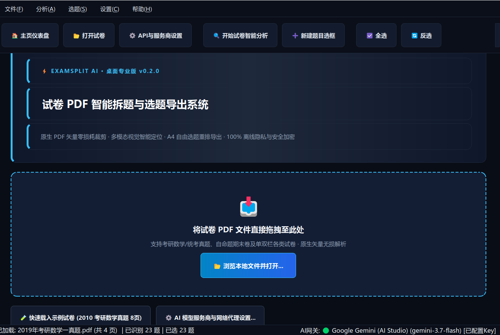
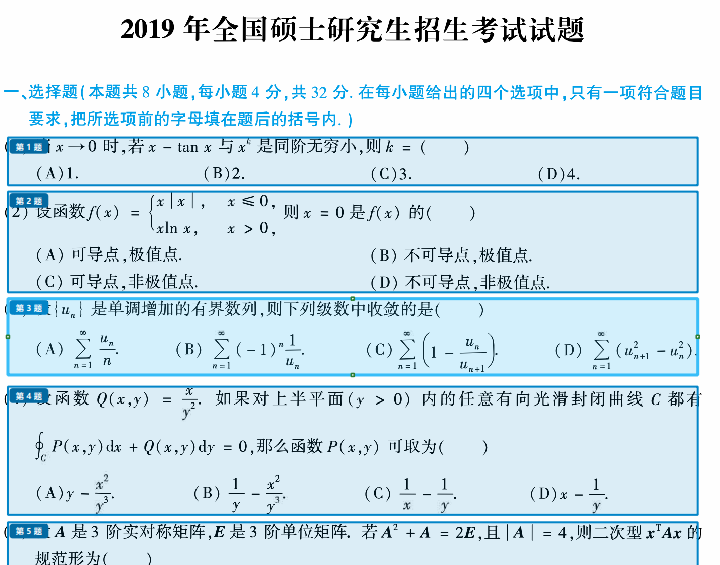
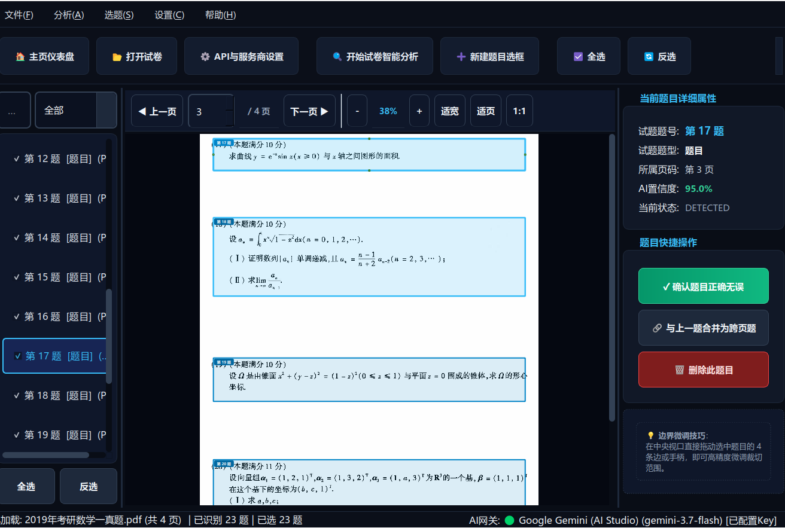
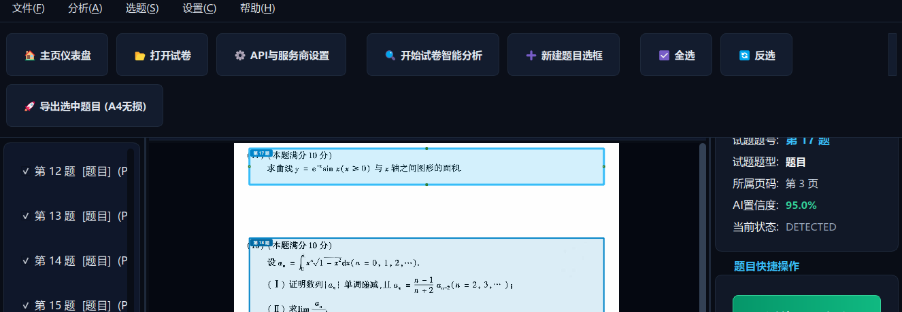
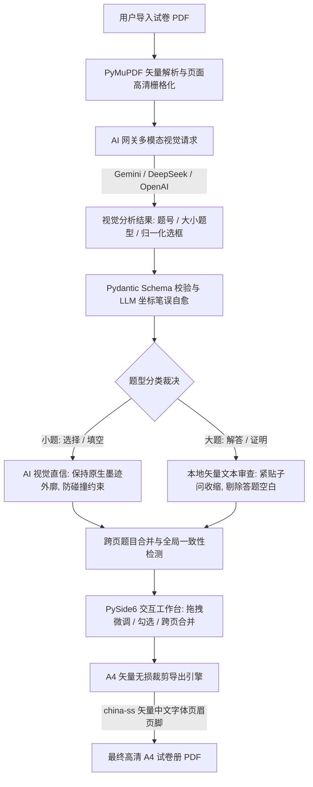

# ExamSplit AI —— 试卷 PDF 智能拆题与精细化选题导出系统

<p align="center">
  
</p>

<p align="center">
  
  
  
  
  
  
</p>

---

## 🌟 项目简介

**ExamSplit AI** 是一款面向教师、备考学生（如考研、高考、竞赛等）与教辅教研人员的现代化桌面级智能排版试卷拆分系统。

传统拆题工具往往依赖 OCR 强行将试卷转录为纯文本，但数学公式、几何矢量图表、特殊符号重排后格式千疮百孔。**ExamSplit AI 坚守“原卷唯一保真”设计哲学**：
- 🤖 **云端多模态 AI（Vision LLM）** 仅用于分析宏观试卷版面结构、判断题型并定位试题外轮廓；
- 🐍 **本地 Python 引擎（PyMuPDF）** 以微米级物理坐标直接对原生 PDF 执行矢量/栅格混合无损裁剪；
- 📄 **A4 精细化导出**：提供“单题一页刷题模式”与“流式紧凑打印模式”，内置标准 CJK 中文字体，页眉题号与页脚页码清晰工整，告别文字重录失真与导出乱码。

> [!TIP]
> **⭐ 如果这个项目对您的备考刷题或教研工作有所帮助，欢迎在 GitHub 点亮右上角的 Star 给予支持！**
> 
> **🐞 遇到任何 Bug 或切分异常？** 非常欢迎随时在 **[Issues](../../issues)** 中反馈交流，每一条建议都会认真排查与解决！

---

## 📌 版本更新日志 (Changelog)

### 🚀 v1.1 (最新版本)
- 🐛 **修复多模型切换回退缺陷**：彻底解决了此前在设置中配置其他 AI 模型（如 DeepSeek、OpenAI、Claude、GLM）后始终退回到 Gemini 的问题，新增默认保存即刻激活机制与优先使用已填 Key 服务商的智能策略；
- 🎯 **新增菜单栏快捷切换**：顶部【设置(&C)】菜单中加入【快速切换当前生效服务商】子菜单，带单选标记，无需打开弹窗即可一键秒级切换；
- 🖱️ **状态栏网关快捷交互**：右下角 `AI网关: 🟢/🟡 ...` 状态标签支持鼠标手型悬停与点击，一键直达设置；
- 🌐 **代理与超时全链路注入**：单试卷与多试卷批量后台分析统一继承全局代理（Proxy）与超时设定，解决外网中继访问不稳定问题；
- 🧪 **单元测试加固**：自动化单元测试提升至 81 项，100% 覆盖多服务商保存、切换与持久化逻辑。

### 🌟 v1.0
- 首次正式版本发布：100% 原生矢量无损裁剪、跨试卷组卷试题篮、大题留白自适应排版、批量试卷后台流水线分析、暗色科技风 UI。

---

## 📸 界面预览与核心功能

### 1. 现代化暗色科技风主页与试卷加载
支持大文件拖拽即开、最近打开试卷历史记忆（卡片自适应展开、单项移除与一键清空）、实时 AI 网关连接状态检测。
<p align="center">
  
</p>

### 2. 密集小题（选择题/填空题）高精视觉切分
针对题干与选项交错密集的单选题、多选题，采纳**“AI 视觉直信”**机制，精确框定题干至选项 (D) 所在行物理外廓，避免本地文本拉扯导致的选项相撞与重叠。
<p align="center">
  
</p>

### 3. 解答大题自动审查、去留白与交互式微调
针对解答题、证明题下方大面积空白草稿区，通过**“本地矢量文本审查”**算法，紧贴 (I)、(II) 等子问题正文截断，彻底剔除虚夸空白；填空题与大题交界处的“三、解答题”等说明文字自动排除。支持右侧栏题目属性查看、跨页题一键合并、4 边把手鼠标自由微调。
<p align="center">
  
</p>

### 4. 自由勾选与 A4 矢量无损导出
支持按需筛选题目导出，提供单题一页与紧凑流式两种版面方案。内置 `china-ss` 矢量中文字体，页眉自动标注试卷名与题号来源，页脚自适应总页数。
<p align="center">
  
</p>

---

## 🚀 核心特性

| 特性模块 | 说明描述 |
| :--- | :--- |
| **100% 原始矢量保真** | 绝对不改动原卷 PDF 内部图文，不进行破坏性 OCR 重排，公式、上下标与几何插图保持原始解析度。 |
| **跨试卷组卷试题篮** | 支持从多份不同试卷中勾选题目加入试题篮，支持**一键连续重排题号**（1, 2, 3...）与**按标准题型智能排序**（选择 ➔ 填空 ➔ 解答 ➔ 证明 ➔ 综合），自由组合跨年份/多科目模拟卷。 |
| **自适应空白排版导出** | 智能区分大题与小题：**小题紧凑排列省纸，大题预留自定义高度答题草稿空白**（支持浅灰虚线框），彻底解决单一小题独占整页的排版痛点。 |
| **试卷批量后台分析队列** | 支持多份试卷一次性导入并在后台流水线分析，实时展示总体与当前进度，**智能跳过已存 SQLite 缓存**，不重复消耗 AI 额度，支持一键批量入篮。 |
| **多试卷工具栏快速切换与更多操作** | 顶部工具栏集成试卷切换器与“更多功能 ▾”下拉菜单，多试卷无缝即时切换，支持快捷批量导入、后台分析与偏好设置。 |
| **多厂商 AI 网关接入** | 原生预设 **Google Gemini (AI Studio)**、**OpenAI (ChatGPT)**、**DeepSeek (深度求索)**、**Claude**、**GLM (智谱清言)** 以及任何兼容 OpenAI 协议的自定义中继服务；支持一键获取可用模型列表。 |
| **白底黑字墨迹裁切** | 提示词与算法深度调优，核心是识别黑字墨迹而非估算留白，大题留白自动收敛至最后字符下方。 |
| **衔接区智能避让** | 选择/填空/大题衔接处的“一、选择题”、“二、填空题”、“三、解答题”等大纲文字纯净剥离，题首绝不向上吞噬。 |
| **大气现代暗色科技风 UI** | 全局 15.5px 大字号正文、宽裕卡片式属性面板、清晰醒目的展开指示（“更多 ▾”）、暗夜荧蓝右键上下文菜单与直观的 44px 主操作按钮组，批阅备课赏心悦目。 |
| **本地密钥 AES 加密** | 用户输入的 API Key 通过 PBKDF2 + Fernet (AES-GCM) 离线加密持久化，保障凭据安全。 |
| **多源 A4 无损导出** | 支持**智能自适应试卷排版**、**单题单页刷题模式**与**紧凑流式省纸模式**，内置 CJK 字体，多源试卷自动标注出处脚注，杜绝乱码。 |

---

## 🛠️ 技术架构



---

## 📦 独立客户端发行版（无需安装 Python）

如果您希望将软件拷贝到另一台电脑上直接双击运行，而无需让用户自行安装配置 Python、Conda 及相关依赖，可直接使用独立免安装发行版：

### 1. Windows 用户使用指南
1. **获取程序包**：下载 `ExamSplitAI_Windows_x64.zip`（或在 Windows 环境下运行 `scripts\build_windows.bat` 一键编译）；
2. **解压与运行**：解压压缩包至任意目录，直接双击 **`ExamSplitAI.exe`** 即可瞬间启动！
3. **便携绿色化**：所有数据库（`data/exam_split.db`）、最近打开试卷记录与加密密钥均保存在程序同级 `data/` 目录中，可直接拷入 U 盘在任意电脑即插即用。

### 2. Linux 用户使用指南
1. **获取程序包**：下载 `ExamSplitAI_Linux_x64.tar.gz`（或在 Linux 环境下运行 `./scripts/build_linux.sh` 一键编译）；
2. **解压与运行**：
   ```bash
   tar -xzf ExamSplitAI_Linux_x64.tar.gz
   cd ExamSplitAI
   ./启动ExamSplit.sh   # 或直接双击 启动ExamSplit.sh / ExamSplitAI
   ```
3. **桌面快捷方式**（可选）：自带 `ExamSplitAI.desktop`，可直接放置到桌面作为常规应用快捷方式。

### 3. 一键编译与跨平台构建
项目已内置跨平台自动化打包体系与 GitHub Actions CI 流程：
- **Linux 本地打包**：运行 `./scripts/build_linux.sh`，全自动清理、编译并打包为 `.tar.gz`；
- **Windows 本地打包**：双击运行 `scripts\build_windows.bat`（或在 PowerShell 下运行 `.\scripts\build_windows.ps1`），全自动打包为 `.zip`；
- **GitHub 自动化云端构建**：推送版本 Tag（如 `v0.2.0`）或在 GitHub Actions 页面点击“Run workflow”，由 GitHub 云端虚拟机并行编译生成 Windows `.exe` 与 Linux 免安装发布包！

---

## 💻 开发者源码安装与运行

如果您需要进行二次开发或调试，也可以通过源码运行：

### 1. 环境准备
推荐使用 **Python 3.11** 环境（推荐通过 Conda 进行环境隔离）：

```bash
# 创建并激活隔离环境
conda create -n examsplit python=3.11 -y
conda activate examsplit

# 克隆或进入项目仓库目录
cd pdf_processor

# 安装核心依赖
pip install -r requirements.txt
```

### 2. 启动应用程序
```bash
# 启动图形桌面界面
python -m app.main
```

### 3. 配置 AI 服务商密钥
1. 启动后，在主界面顶部点击 **“⚙️ API与服务商设置”**；
2. 选择您的服务商（例如 **Google Gemini** 或 **DeepSeek** / **OpenAI**）；
3. 填入您的 `API Key`，点击 **“刷新可用模型”** 即可快速加载并选择对应模型；
4. 点击 **“保存配置”**（密钥将通过本地强加密保存，之后无需重复输入）。

---

## 🧪 测试与质量保证

项目采用完整的自动化单元测试套件，全面覆盖 AI 适配器、响应解析器、文本吸附算法、坐标防吞并逻辑、试题删除选框画布联动及 PDF 导出：

```bash
# 运行全部 81 项单元测试
python -m pytest tests/unit/ -v
```

```text
============================== 81 passed in 4.22s ==============================
```

---

## 📁 目录结构

```text
pdf_processor/
├── app/
│   ├── ai/               # AI 适配层 (Gemini, OpenAI, DeepSeek, Claude, GLM 等)
│   ├── detection/        # 题目定位、边界推导、跨页合并与一致性检查引擎
│   ├── models/           # Pydantic 数据模型 (Question, Segment, AIResult 等)
│   ├── pdf/              # PDF 读取、渲染、坐标投影与 A4 矢量无损导出器
│   ├── storage/          # SQLite 数据库与历史记录管理器
│   └── ui/               # PySide6 界面组件 (主页仪表盘、工作台、微调画布、设置窗口)
├── prompts/              # 版本化 AI 系统提示词 (detect_markers.txt)
├── data/                 # 本地持久化存储 (数据库、最近打开记录、凭据文件)
├── test_pic/             # 界面展示截图与视觉素材
├── tests/                # Pytest 单元测试与端到端回归测试集
└── README.md             # 项目说明文档
```

---

## 💬 交流与反馈

- **Star 鼓励**：如果这个项目帮到了您，请在 GitHub 点亮右上角的 **Star ⭐** 支持一下作者！
- **问题反馈**：若在使用过程中遇到任何 Bug、UI 异常或切分边界问题，欢迎随时在 **[GitHub Issues](../../issues)** 中提出，每一条 Issue 都会认真跟进修复。
- **开源共建**：欢迎提交 Pull Request，一起完善视觉定位规则、题型分类与无损排版算法！

---

## 📄 开源许可证

本项目基于 [MIT 许可证](LICENSE) 开源。欢迎学术交流、教学教研使用与社区贡献 PR！
